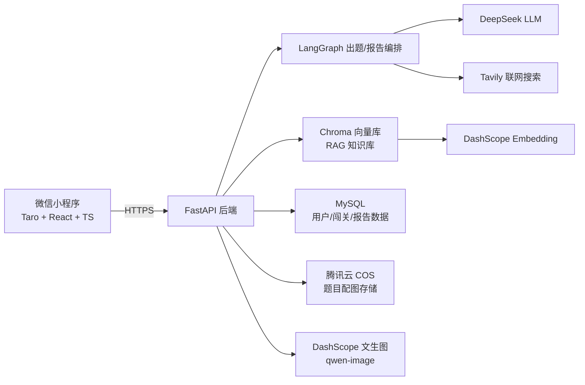

# 鱼皮 AI 闯关学习小程序（yu-ai-learn）

> 输入一个你想学的知识点（一句话、一段话、一个文档），AI 自动联网检索 / 解析文档，生成互动闯关题库，
> 答题闯关后自动生成学习复盘报告 —— 一个把"学习"变成"闯关游戏"的 AI 微信小程序。

## ✨ 这是什么

现代学习者常常面临"信息过载"与"学习动力不足"的双重痛点。本项目尝试用 AI 把非结构化的海量信息
（一句话概念、文档、网页）瞬间转化为结构化、有反馈、游戏化的问答闯关体验，全流程跑通
**输入 → AI 出题 → 闯关答题 → 复盘报告** 的学习闭环。

## 🎯 核心功能

- **一句话起题**：主页只有一个输入框，输入你想学的知识点即可开始。
- **AI 联网检索 + 出题**：基于 [LangChain](https://www.langchain.com/) / [LangGraph](https://www.langchain.com/langgraph)
  编排，结合 [Tavily](https://tavily.com/) 联网搜索，自动补全知识背景并生成单选 / 多选 / 判断题，
  每题都配有 AI 生成的深度讲解。
- **多格式知识库（RAG）**：支持上传 PDF / Word 文档构建私有知识库，基于
  [Chroma](https://www.trychroma.com/) 向量库做检索增强生成（RAG），针对私有资料出题。
- **题目配图**：调用文生图模型（千问 qwen-image）为题目自动生成配图，并持久化存储到腾讯云 COS。
- **游戏化闯关机制**：答题实时反馈对错与讲解，通关后得到经验值 / 成就反馈。
- **AI 复盘报告**：通关后自动生成本次学习的正确率分析、知识点掌握度总结。
- **微信小程序原生体验**：基于 [Taro](https://taro.zone/) + React + TypeScript 开发，一套代码可编译到微信小程序 / H5。
- **微信登录与用户体系**：`wx.login()` + `jscode2session` 完成免注册登录，MySQL 持久化用户与闯关记录。

## 🏗️ 技术架构



### 技术栈

| 层面 | 技术选型 |
| --- | --- |
| 小程序前端 | Taro 4 · React 18 · TypeScript · Sass |
| 后端服务 | Python · FastAPI · Pydantic v2 · Uvicorn |
| AI 编排 | LangChain · LangGraph · langchain-openai |
| 大模型 / 检索 | DeepSeek（出题/报告）· DashScope 百炼（Embedding / 文生图）· Tavily（联网搜索） |
| 向量检索 | Chroma（RAG 知识库） |
| 数据存储 | MySQL（aiomysql）· 腾讯云 COS（对象存储） |
| 鉴权 | 微信 `jscode2session` + JWT |
| 部署 | Docker · 微信云托管 |

## 📁 项目结构

```
backend/            FastAPI 后端服务
  app/
    api/v1/routes/  路由：quiz（出题）、report（报告）、user（用户）、knowledge（知识库）
    llm/            LangChain/LangGraph 编排：出题链、报告链
    prompts/        Prompt 模板
    services/       业务逻辑：出题、RAG、图片生成、COS 上传、用户等
    repositories/    数据访问层
    models/         Pydantic 数据模型
  tests/            pytest 测试用例
frontend/           微信小程序前端（Taro + React）
  src/pages/        首页 / 答题 / 报告 / 知识库 / 我的
  config/           按环境区分的构建配置（dev / prod）
openspec/           基于 OpenSpec 流程管理的需求变更与规格文档
docs/               需求分析、方案设计等项目文档
```

## 🚀 快速开始

### 后端

```bash
cd backend
pip install -r requirements.txt
cp .env.example .env   # 按需填写 DeepSeek / DashScope / Tavily / MySQL / 微信 等配置
python -m uvicorn app.main:app --reload --host 0.0.0.0 --port 8000
```

### 前端（微信小程序）

```bash
cd frontend
npm install
npm run dev:weapp   # 编译到 dist/，用微信开发者工具打开 dist 目录预览
```

生产构建（对接线上后端域名）：

```bash
npm run build:weapp
```

> 前端会根据构建环境（`dev` / `prod`，见 `frontend/config/`）自动注入不同的后端地址。

### 后端测试

```bash
cd backend
pytest
```

## 📦 部署

`backend/Dockerfile` 提供了适配**微信云托管**的多阶段构建镜像；也可以直接用于任意支持 Docker 的容器平台。
部署所需的密钥类环境变量（数据库密码、各类 API Key、微信 AppSecret 等）请通过平台的环境变量功能注入，
**不要**提交到代码仓库（参考 `.gitignore` / `backend/.dockerignore`）。

## 📄 License

本项目基于 [MIT License](./LICENSE) 开源。
