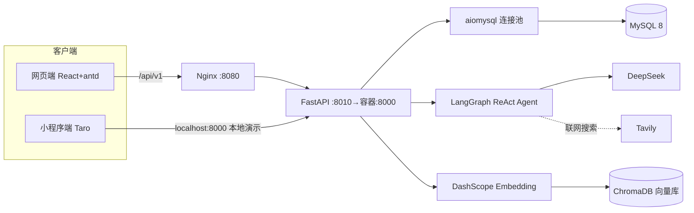

# 企业内部培训智能考核系统

把公司的培训资料交给 AI，自动出题、自动判分、自动生成复盘报告，管理员实时看成绩。

传统内训考核有三个痛点：**出题慢**（一份合规手册人工出 5 道题要半小时）、**判分主观**（简答题没人愿意批）、**成绩难汇总**（考完散落在聊天记录里）。这个项目针对这三点做了一条完整链路：上传培训资料 → 向量化入库 → AI 按资料出题 → 逐题即时判分 → AI 复盘报告 → 管理端成绩报表。

同一套后端支撑两个前端：**网页端**（管理端 + 员工端，已部署）和**微信小程序端**（员工碎片时间自测，本地演示）。

---

## 演示入口

| 端 | 地址 | 说明 |
| --- | --- | --- |
| 网页端（管理端 / 员工端） | <http://47.120.34.207:8080> | 阿里云 ECS，Docker Compose + Nginx 反代。域名需 ICP 备案（未备案的 `.cn` 域名连 8080 都会被拦成 403），故直接用 IP:端口 |
| 小程序端 | 本地编译后用微信开发者工具打开 `frontend/dist` | 测试号，未发布。详见 [保姆级本地运行指南](docs/保姆级本地运行指南.md) |
| 接口文档 | 后端启动后访问 `http://127.0.0.1:8000/docs` | FastAPI 自动生成 |

---

## 核心功能

**管理端（网页）**

- 员工管理：批量建号、重置密码、停用账号（停用后 JWT 仍然有效但请求会被拦，见「关键设计」）
- 培训资料：上传 PDF / Word / Markdown，异步解析切片并写入向量库，实时显示分片数与状态
- 考核任务：基于某份资料发布一套考核，可配置题量、难度、及格线、截止时间
- 成绩报表：按考核任务汇总参考人数、平均正确率、通过率，可下钻到每个人的答题明细

**员工端（网页）**

- 我的考核：列出待完成 / 已完成 / 已截止的任务
- 答题：逐题提交、即时判分与讲解，多选支持部分选中，答错不显示正确答案直到提交
- 我的成绩 + AI 复盘报告：掌握度、薄弱知识点、知识总结、后续建议

**小程序端（Taro，同一后端）**

- 一句话自拟主题让 AI 出题，也可选自己上传的培训资料出题
- 逐题即时反馈、AI 复盘报告、考核积分、我的培训资料

---

## 技术栈

| 层 | 选型 |
| --- | --- |
| AI 编排 | LangChain + LangGraph（`create_react_agent` 实现 Agentic RAG）、Tavily 联网搜索 |
| 大模型 | DeepSeek（OpenAI 兼容协议，默认 `deepseek-chat`，可用 `DEEPSEEK_MODEL` 覆盖） |
| 向量检索 | ChromaDB（按用户隔离 collection）+ 阿里云 DashScope `text-embedding-v4` |
| 后端 | Python 3.12 + FastAPI + aiomysql 连接池（裸 SQL，未用 ORM）+ structlog 结构化日志 |
| 数据库 | MySQL 8，7 张表，启动时幂等迁移 |
| 网页端 | Vite + React 19 + Ant Design 6 + TypeScript + react-router 7 |
| 小程序端 | Taro 4 + React 18 + Sass（一套代码编译 weapp / H5） |
| 鉴权 | bcrypt（cost 12）+ JWT HS256（payload 带 `role`）+ FastAPI 依赖注入做 RBAC |
| 部署 | Docker Compose（mysql + backend）+ 宝塔 Nginx 静态托管与反向代理 |

---

## 架构



出题链路（`backend/app/llm/quiz_chain.py` → `app/services/quiz_service.py`）：

```
用户输入 / 培训资料
  ├─ 有关联资料 → ChromaDB 按 doc_owner_id 召回 top-k 片段
  ├─ 无资料     → ReAct Agent 自行决定搜什么、搜几轮（Tavily）
  └─ 拼装 Prompt → DeepSeek → 严格 JSON 解析 → 落库 quiz_sessions
```

出题耗时约 7 秒，因此走**异步任务 + 前端轮询**：`POST /quiz/async` 秒级返回 `task_id`，前端每 2 秒轮 `GET /task/{id}`，避免长连接被网关切断。

---

## 关键设计

**1. Agentic RAG，而不是固定检索一次**

朴素 RAG 检索一次就出题，遇到用户输入很短（"RAG 和传统搜索有什么区别"）时召回质量差。这里用 `create_react_agent` 让模型自己判断"要不要搜、搜什么词、搜几轮"，并允许它根据第一轮结果改写查询再搜。当用户指定了培训资料时，改用向量召回并**强制以资料为准**，保证考核内容可溯源到公司文档。

**2. 密码与鉴权**

- 密码用 bcrypt（cost 12）加盐哈希，实测单次哈希约 200ms。这个"慢"是特性不是缺陷：它把离线爆破的成本抬高约 4 个数量级，而登录是低频操作，200ms 用户无感。
- JWT payload 带 `role`，但**不信 token 里的角色**：`get_current_web_user` 每次回查数据库并校验 `status == 1`，所以管理员停用账号后，该账号手里的有效 token 立刻失效。`get_current_admin` 在其之上再叠一层角色判断。
- 小程序用 `openid` 静默登录，网页端用 `username/password`，两套身份共用 `users` 表，靠 `role` 字段区分路由。

**3. 数据隔离**

知识库按用户建独立 collection（`kb_user_{user_id}`），检索时带上 `doc_owner_id` 过滤，避免 A 员工上传的资料被 B 员工出题时召回。管理端跨员工查询走独立的 admin 接口，不复用员工端查询路径。

**4. 结构化输出与容错**

Prompt 里明确"只能输出合法 JSON"，解析层再做一次校验：题量不足自动补齐、判断题选项强制为「正确/错误」、多选答案少于 2 个判为无效并重试。AI 报告落库失败不阻断答题流程（`report_service.py` 里持久化异常只记日志）。

---

## 项目结构

```
backend/          FastAPI 后端
  app/api/v1/routes/   auth / admin / assessment / knowledge / quiz / report / user
  app/services/        业务编排（出题、判分、报告、知识库）
  app/llm/             LangGraph Agent、Prompt 链、Embedding
  app/repositories/    裸 SQL 数据访问
  app/core/            config / db（含幂等迁移）/ auth / password / security
  tests/               165 个用例
web/              网页端（管理端 + 员工端），Vite + React + antd
frontend/         小程序端，Taro 4（编译 weapp / H5）
docs/             需求分析、方案设计、部署手册、本地运行指南、面试讲解要点
samples/          演示用培训资料
prototypes/       早期 AI 生成的原型图
```

---

## 本地运行

```bash
# 1. 后端
cd backend
cp .env.example .env          # 填 DeepSeek Key、MySQL 连接信息
pip install -r requirements.txt
python -m scripts.init_admin <管理员用户名> <密码>   # 不传默认口令，必须自己指定
./venv/Scripts/python.exe -m uvicorn app.main:app --host 127.0.0.1 --port 8000

# 2. 网页端
cd ../web && npm install && npm run dev

# 3. 小程序端（需微信开发者工具）
cd ../frontend && npm install --legacy-peer-deps && npm run dev:weapp
```

MySQL 需要单独准备。完整的环境差异说明（含免安装版 MySQL、Taro prebundle 兼容问题等 5 处坑）见 [docs/本地运行环境记录.md](docs/本地运行环境记录.md)。

## 测试

```bash
cd backend && ./venv/Scripts/python.exe -m pytest -q
# 165 passed
```

覆盖鉴权与 RBAC、出题与判分、知识库上传与召回、异步任务状态机、成绩聚合。

## 部署

Docker Compose 起 `mysql + backend`，宿主机端口只绑 `127.0.0.1:8010`（8000 已被服务器上另一项目占用），Nginx 在 8080 做静态托管与 `/api/` 反代，MySQL 不出内网。逐步命令与踩过的坑见 [docs/服务器部署操作手册.md](docs/服务器部署操作手册.md)。

---

## 已知限制（诚实清单）

- 小程序用测试号，未发布，只能本地开发者工具演示；「关于小程序」面板里的名字由平台分配，改不了。
- 域名未备案：阿里云对未备案域名在任意端口都会拦截（实测 8080 返回 403 `Non-compliance ICP Filing`），所以对外访问只能用 IP:端口。
- 成绩海报按钮只弹「开发中」提示，未实现 canvas 绘制。
- 员工列表时间格式带 `T`（`2026-09-20T18:17:52`），成绩报表是空格分隔，两处不一致，未修。
- 出题依赖大模型，偶发返回非法 JSON 或题量不足；已做校验与补齐，但没有做多次重试。

---

## 来源与致谢

本项目基于 [程序员鱼皮](https://github.com/liyupi) 的开源教学项目 [yu-ai-learn](https://github.com/liyupi/yu-ai-learn)（MIT License）二次开发，原始教程为编程导航《Python 全栈 | AI 闯关学习小程序项目教程》。上游 12 个提交（`d12efdf`…`d68cf0b`）完整保留在本仓库 `main` 分支历史中，本项目的改动叠在其上。

在原始「AI 闯关学习」骨架之上，独立完成的改造包括：

- **产品重定位**：从个人学习工具改为企业内训考核系统，全链路术语、文案、Prompt 人设重写
- **网页端整套新增**：管理端 4 页 + 员工端 3 页（React 19 + antd 6），原仓库只有小程序
- **账号体系**：用户名/密码登录、bcrypt 哈希、JWT `role` + 数据库回查的 RBAC、员工批量建号与停用
- **考核任务模型**：培训资料 → 考核任务 → 成绩聚合的领域建模，含及格线、截止时间、补考次数
- **知识库按用户隔离**、成绩报表聚合与下钻
- **生产部署**：Docker Compose + Nginx 反代 + 安全组策略，以及配套的部署手册与故障排查表

## License

MIT（见 [LICENSE](LICENSE)，版权属原作者 liyupi）
