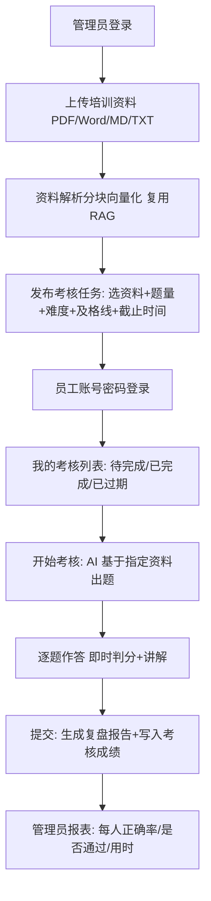

# 《企业内部培训智能考核系统》网页端需求分析文档

> 迭代编号：WEB-1　|　状态：**待人工确认**　|　配套方案：[网页端方案设计文档](./网页端方案设计文档.md)
>
> 本文只写"要做什么、为什么"，不写实现细节。实现细节见方案设计文档。

---

## 0. 一句话目标

把现有《鱼皮 AI 闯关学习小程序》**重新包装为「企业内部培训智能考核系统」**：
新增一个**网页端**并部署到公网用于求职面试演示；小程序端保留，仅本地运行演示。

## 1. 需求背景

- **核心痛点（求职侧）：** 小程序上线需服务类目申请 + ICP 备案 + 代码审核，周期以周计，
  赶不上面试演示时间线；而网页端部署当天可上线。
- **核心痛点（产品侧）：** 原项目是 C 端学习玩具，与"企业内部培训考核"这一 B 端场景
  缺少两个关键角色能力：**管理员下发考核** 与 **管理员看成绩**。
- **产品定位：** 面向企业培训负责人（管理员）与员工（被考核人）的 AI 考核闭环：
  上传培训资料 → AI 基于资料出题 → 员工限时闯关 → 自动判分讲解 → 生成复盘报告 → 管理员看报表。
- **差异化壁垒：** 不是"把小程序搬上网页"，而是补上 **RBAC 角色权限 + 考核任务流 + 成绩报表**
  这三块 B 端骨架，复用已验收的 AI 出题 / RAG / 判分 / 报告能力。

## 2. 角色与核心业务流程

两个角色：

| 角色 | 标识 | 能做什么 |
| --- | --- | --- |
| 管理员 | `admin` | 建/改/停用员工账号、重置密码；上传培训资料；发布考核任务；查看成绩报表 |
| 员工 | `employee` | 账号密码登录；查看待完成考核；进入考核答题；查看即时讲解与复盘报告；查看本人历史成绩 |

核心闭环（管理员视角 → 员工视角）：

## 3. MVP 功能点（P0，本次必做）

1. **账号密码登录**：管理员/员工统一登录页；JWT 鉴权；密码 bcrypt 加盐哈希存库。
2. **员工账号管理（管理员）**：新建（含初始密码、部门）、列表、编辑、启用/停用、重置密码。
3. **培训资料管理（管理员）**：上传、列表（状态/分块数）、删除。完全复用现有知识库能力。
4. **考核任务管理（管理员）**：发布（标题、绑定资料、题量、难度、及格正确率、截止时间）、
   列表、关闭。
5. **我的考核（员工）**：按状态分组的考核列表；未过期可进入答题。
6. **考核答题**：单选/多选/判断三题型，逐题即时判分 + 讲解（交互与小程序一致）。
7. **复盘报告**：通关后生成掌握度、薄弱点、总结、建议（复用现有报告能力）。
8. **考核成绩落库与报表（管理员）**：按考核看全部员工成绩（正确率、是否通过、用时、提交时间），
   按员工看个人全部成绩。

## 4. 扩展功能点（P1，时间允许再做，不阻塞上线）

| 优先级 | 功能 | 说明 |
| --- | --- | --- |
| P1 | 部门维度报表 | 按部门聚合平均分/通过率 |
| P1 | 成绩导出 CSV | 管理员一键导出 |
| P1 | 员工自由学习模式 | 自选资料刷题，不计入考核成绩（即现有 quiz 自由出题流） |
| P1 | 首次登录强制改密 | 员工用初始密码登录后必须改密 |
| P2 | 域名 + ICP 备案 + HTTPS | 需先把 ECS 转包年包月；列为独立第二阶段，见方案文档 |

## 5. 明确不做（P2 / 否决项）

- 短信验证码 / 邮箱验证码登录（成本 + 审核 + 不像企业内部系统）
- 企业微信 / 钉钉 / LDAP / SSO 对接（演示项目无真实企业环境，纯摆设）
- 人工编辑题库 / 题目审核流（与"AI 出题"定位冲突，工作量大）
- 组织架构树、多级部门、权限细粒度到按钮级（RBAC 只做 admin/employee 两级）
- 小程序端任何改动（小程序保持现状，仅本地演示）

## 6. 验收标准（可勾选）

- [ ] 管理员能用账号密码在浏览器登录，看到管理端四个页面
- [ ] 管理员建一个员工账号，该员工能用自己的账号密码登录
- [ ] 管理员上传一份 MD 培训资料，状态变为 ready 且分块数 > 0
- [ ] 管理员基于该资料发布考核，员工端"我的考核"出现该任务
- [ ] 员工完成答题，每题即时看到对错与讲解，通关后看到复盘报告
- [ ] 管理员报表中能看到该员工的正确率、是否通过、用时
- [ ] 停用某员工后，该员工 token 失效或登录被拒（实现方式见方案）
- [ ] **回归**：微信小程序端 `wx.login` 静默登录与答题流程不受影响
- [ ] 公网 `http://47.120.34.207:<端口>` 可打开登录页并完成上述闭环

## 7. 非功能需求

- **安全**：密码只存 bcrypt 哈希；JWT 带 role；管理端接口全部过 `admin` 校验；
  `.env` / 密钥永不入库（已有 `.gitignore` 覆盖）。
- **兼容**：后端对小程序的既有接口契约**一个字段都不改、不删**，只允许新增。
- **性能**：出题为异步任务 + 轮询（沿用现有机制），前端需展示进度，避免 HTTP 超时。
- **成本**：不新增任何付费服务；复用现有 ECS / 宝塔 / DeepSeek / 百炼 Key。
